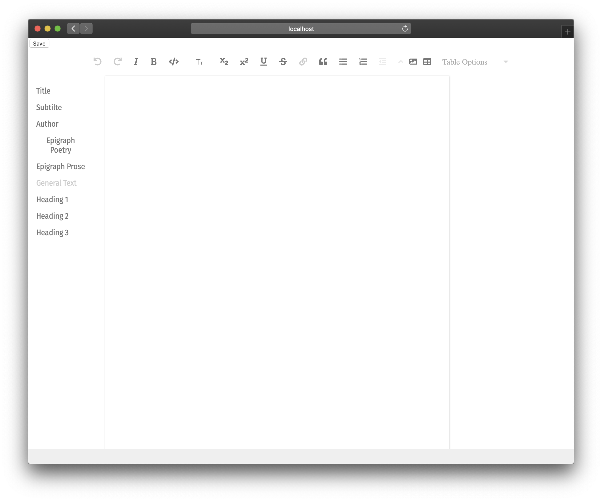

# editor

The Hypergraph Editor, based on [Wax](https://gitlab.coko.foundation/wax/wax-prosemirror).



## Installation

```bash
$ npm install -g @hypergraph-xyz/editor
```

## Usage

```bash
$ hypergraph-edit FILE
```

```js
const Editor = require('@hypergraph-xyz/editor')

const editor = new Editor('FILE')
editor.open()
```